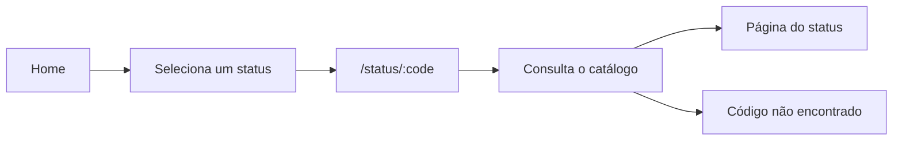

<div align="center">


<br>

Aplicação web para explorar códigos de status HTTP através de exemplos práticos e cenas do universo Pokémon.

<br><br>

[](https://react.dev/)
[](https://www.typescriptlang.org/)
[](https://tailwindcss.com/)
[](https://vite.dev/)
[](https://vercel.com/)

### [Acessar online](https://httpmon.vercel.app/) · [Repositório](https://github.com/EnzoNukui/HTTPmon)

</div>

---

## Preview

<p align="center">
  
  
</p>

---

## Sobre o projeto

O **HTTPmon** é uma aplicação web criada para tornar o aprendizado de códigos de status HTTP mais visual, intuitivo e divertido.

Em vez de apresentar apenas definições, cada código é associado a uma cena do universo Pokémon que representa a situação daquele status. Ao acessar um código, é possível consultar seu significado, exemplos de requisição e resposta, causas comuns e outros status relacionados.

O projeto nasceu como uma forma de unir desenvolvimento front-end com um conceito fundamental da web: a comunicação através do protocolo HTTP.

---

## Funcionalidades

- Consulta de códigos de status HTTP das categorias `1xx` a `5xx`.
- Página dedicada para cada código.
- Explicações em linguagem simples e direta.
- Exemplos de requisições e respostas HTTP.
- Principais causas relacionadas a cada status.
- Navegação entre códigos relacionados.
- Associação de cada status a uma cena do universo Pokémon.
- Página personalizada para códigos não cadastrados.
- Interface responsiva para diferentes tamanhos de tela.

---

## Como funciona

O HTTPmon utiliza uma página reutilizável para exibir os detalhes de todos os códigos cadastrados.

Ao selecionar um status na página inicial, a aplicação navega para uma rota dinâmica no formato:

```text
/status/:code
```

Por exemplo:

```text
/status/404
```

O código presente na URL é usado para localizar as informações correspondentes no catálogo local da aplicação. A mesma estrutura de página é então preenchida dinamicamente com os dados daquele status.



### Principais rotas

| Rota | Conteúdo |
| --- | --- |
| `/` | Página inicial com os códigos agrupados por categoria. |
| `/status/:code` | Exibe os detalhes do código informado. |
| Qualquer outra rota | Página de código não encontrado. |

---

## Tecnologias

### Frontend

- **React 19**
- **TypeScript 6**
- **React Router 8**
- **Tailwind CSS 4**
- **React Icons**
- **Vite 8**

### Qualidade de código

- **Oxlint**

### Deploy

- **Vercel**

---

## Estrutura do projeto

```text
src/
├── assets/
│   └── images/          # Imagens e identidade visual
│
├── components/
│   ├── Cards/           # Cards exibidos na página inicial
│   ├── CardsPokemon/    # Mídias relacionadas aos status
│   └── Footer/          # Rodapé e navegação auxiliar
│
├── pages/
│   ├── Error/           # Página para rotas e códigos inexistentes
│   ├── Home/            # Página inicial
│   └── Status/          # Página reutilizável de detalhes
│
├── routes/              # Configuração das rotas
├── services/            # Catálogo dos códigos HTTP
├── types/               # Tipos compartilhados
│
├── App.tsx
└── globals.css

docs/
└── images/              # Capturas utilizadas no README
```

As informações dos códigos ficam centralizadas em:

```text
src/services/httpStatuses.ts
```

Essa estrutura permite reutilizar os mesmos componentes e alterar apenas os dados exibidos de acordo com o código acessado.

---

## Executar localmente

### Pré-requisitos

- Node.js
- Git

### 1. Clone o repositório

```bash
git clone https://github.com/EnzoNukui/HTTPmon.git
```

### 2. Acesse a pasta

```bash
cd HTTPmon
```

### 3. Instale as dependências

```bash
npm install
```

### 4. Inicie a aplicação

```bash
npm run dev
```

O Vite exibirá no terminal o endereço local da aplicação.

### Comandos disponíveis

| Comando | Descrição |
| --- | --- |
| `npm run dev` | Inicia o servidor de desenvolvimento. |
| `npm run build` | Verifica os tipos e gera o build de produção. |
| `npm run preview` | Executa localmente o build de produção. |
| `npm run lint` | Analisa o código utilizando Oxlint. |

---

## Principais aprendizados

O desenvolvimento do HTTPmon permitiu trabalhar com:

- componentização de interfaces com React;
- tipagem de dados e componentes com TypeScript;
- rotas dinâmicas com React Router;
- reutilização de componentes a partir de dados estruturados;
- organização de informações em um catálogo local;
- desenvolvimento de layouts responsivos com Tailwind CSS;
- tratamento de rotas e códigos inexistentes;
- organização da estrutura de uma aplicação React;
- funcionamento e significado dos códigos de status HTTP.

O projeto também envolveu a criação de relações visuais entre códigos HTTP e situações do universo Pokémon, buscando tornar conceitos técnicos mais fáceis de interpretar e memorizar.

---

## Mídias e escopo

As animações utilizadas no HTTPmon são carregadas através de URLs do **Tenor** e precisam de conexão com a internet para serem exibidas.

A aplicação não realiza uma consulta à API do Tenor a cada acesso. As URLs das mídias ficam armazenadas junto aos dados de cada status.

O catálogo inclui códigos HTTP padronizados e também alguns códigos utilizados por serviços e plataformas específicas.

---

## Aviso

O HTTPmon é um projeto educacional independente e não possui vínculo oficial com Pokémon, The Pokémon Company, Nintendo, Game Freak ou Creatures Inc.

Pokémon e seus personagens são propriedade de seus respectivos titulares.

As animações utilizadas são disponibilizadas através do Tenor e usadas somente como recurso visual e educacional.

---

## Status

O projeto está funcional e disponível online.

**Demo:** https://httpmon.vercel.app/

---

## Autor

Desenvolvido por **Enzo Nukui**.

- GitHub: [@EnzoNukui](https://github.com/EnzoNukui)
- LinkedIn: [linkedin.com/in/enzo-nukui](https://www.linkedin.com/in/enzo-nukui/)

---

<div align="center">

Projeto desenvolvido para unir **desenvolvimento front-end, HTTP e aprendizado visual** em uma única aplicação.

</div>