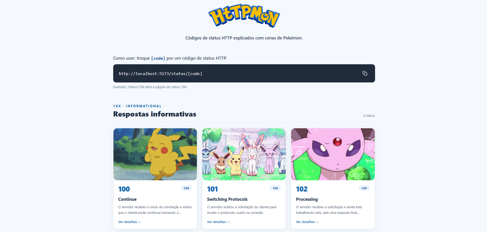
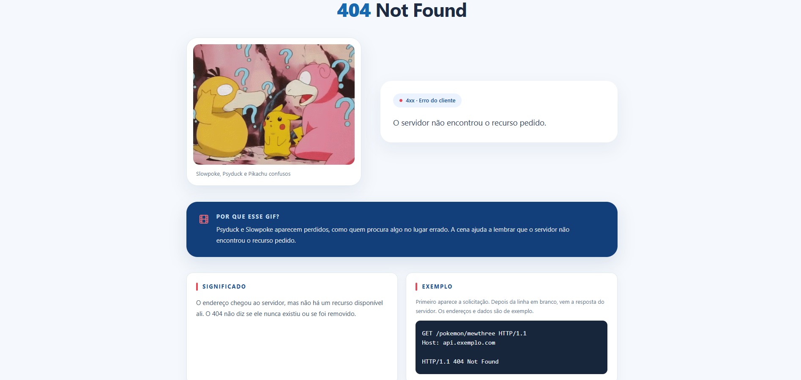
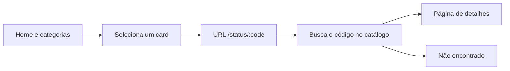

<h1 align="center">HTTPmon</h1>

<hr />

<p align="center">
  Explore os códigos de status HTTP com exemplos práticos e cenas de Pokémon.
</p>

<p align="center">
  
  
  
  
  
</p>

<p align="center">
  <a href="#prévia-do-projeto">Ver prévia</a> ·
  <a href="#executar-localmente">Executar localmente</a>
</p>

---

## Prévia do projeto

<table>
  <tr>
    <th align="center">Página inicial</th>
    <th align="center">Página do status 404</th>
  </tr>
  <tr>
    <td width="50%">
      
    </td>
    <td width="50%">
      
    </td>
  </tr>
</table>

---

## Visão geral

O HTTPmon transforma uma lista de códigos HTTP em uma experiência visual e navegável. Na página inicial, os status ficam agrupados por categoria. Ao selecionar um card, a aplicação abre uma página com o significado do código, um exemplo prático, causas comuns, status relacionados e uma animação que ajuda a memorizar a ideia.

O projeto foi criado para apoiar o aprendizado de HTTP e praticar a construção de uma aplicação React organizada por rotas e dados. Os exemplos usam situações simples, como consultar um recurso que não existe e receber `404 Not Found`.

### O que você encontra

- Status agrupados em `1xx`, `2xx`, `3xx`, `4xx` e `5xx`.
- Uma página de detalhes compartilhada entre os códigos, preenchida conforme a rota acessada.
- Explicações em linguagem direta, exemplos de requisição e resposta e causas comuns.
- Links para status relacionados e navegação de volta à lista.
- Animações de Pokémon com uma explicação da relação entre a cena e o status.
- Interface adaptável a telas grandes e pequenas.

## Categorias de status

| Faixa | Categoria | Em poucas palavras |
| --- | --- | --- |
| `1xx` | Informativo | A solicitação foi recebida e o processamento continua. |
| `2xx` | Sucesso | A solicitação foi recebida, entendida e atendida. |
| `3xx` | Redirecionamento | É necessária outra ação para concluir a solicitação, geralmente acessar outra URL. |
| `4xx` | Erro do cliente | Há um problema na solicitação ou nas condições para atendê-la. |
| `5xx` | Erro do servidor | O servidor encontrou uma falha ao tentar atender a solicitação. |

O significado exato depende do código. As páginas individuais apresentam as diferenças e os exemplos correspondentes.

## Rotas e navegação

| Rota | Conteúdo |
| --- | --- |
| `/` | Página inicial, com os status agrupados por categoria. |
| `/status/:code` | Detalhes do código informado, por exemplo `/status/404`. |
| Qualquer outra rota | Página de código não encontrado. |

Todos os códigos usam o mesmo componente de página. A rota fornece o código, e a aplicação procura os dados correspondentes no catálogo local. Assim, o conteúdo muda sem criar uma página separada para cada status.



## Tecnologias

| Tecnologia | Uso no projeto |
| --- | --- |
| React | Componentes e interface. |
| TypeScript | Tipos para os dados e componentes. |
| React Router | Rotas da home, das páginas de status e de erro. |
| Tailwind CSS | Estilos e comportamento responsivo. |
| Vite | Servidor de desenvolvimento e build. |
| React Icons | Ícones da interface. |

## Executar localmente

### Pré-requisitos

- Node.js instalado.
- npm, incluído com Node.js.

Na pasta do projeto, instale as dependências e inicie o servidor:

```bash
npm install
npm run dev
```

O Vite mostrará no terminal o endereço local da aplicação. Abra esse endereço no navegador. Para testar um status diretamente, acrescente `/status/` e o código à URL local, como em `/status/404`.

### Comandos disponíveis

| Comando | Descrição |
| --- | --- |
| `npm run dev` | Inicia o servidor de desenvolvimento. |
| `npm run build` | Verifica os tipos e cria o build de produção em `dist/`. |
| `npm run preview` | Serve localmente o build de produção. |
| `npm run lint` | Verifica o código com Oxlint. |

## Estrutura do projeto

```text
src/
├── assets/images/       # Logo do HTTPmon
├── components/
│   ├── Cards/           # Cards da página inicial
│   ├── CardsPokemon/    # Exibição da mídia do status
│   └── Footer/          # Rodapé e navegação auxiliar
├── pages/
│   ├── Error/           # Rota não encontrada
│   ├── Home/            # Lista de códigos por categoria
│   └── Status/          # Página reutilizável de detalhes
├── routes/              # Definição das rotas
├── services/            # Catálogo local dos status HTTP
├── types/               # Tipos compartilhados
├── App.tsx
└── globals.css          # Estilos globais

docs/images/             # Capturas usadas neste README
```

Os dados de cada status ficam em `src/services/httpStatuses.ts`. O tipo compartilhado em `src/types/` mantém a estrutura dos dados consistente entre os cards e as páginas de detalhes.

## Mídias e escopo

As animações são carregadas de URLs do Tenor e precisam de conexão com a internet para aparecer. A aplicação não consulta a API do Tenor em cada acesso; ela usa as URLs cadastradas junto aos dados dos status.

O catálogo inclui códigos HTTP e alguns códigos usados por serviços específicos. Quando um número não está cadastrado, a aplicação apresenta a página de código não encontrado.

## Créditos

O HTTPmon é um projeto educacional independente. Pokémon e seus personagens são propriedade de seus respectivos titulares. As animações são disponibilizadas pelo Tenor e usadas como referência visual para explicar os status HTTP.

## Autor

Desenvolvido por **Enzo Nukui**.

- GitHub: [@EnzoNukui](https://github.com/EnzoNukui)
- LinkedIn: [linkedin.com/in/enzo-nukui](https://www.linkedin.com/in/enzo-nukui/)


