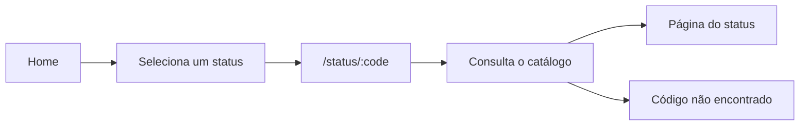

<div align="center">

# HTTPmon

### Aprenda códigos de status HTTP através do universo Pokémon.

Uma experiência visual e interativa para explorar códigos HTTP, entender seus significados e aprender através de exemplos práticos e cenas de Pokémon.

<br>

<a href="https://httpmon.vercel.app/">
  <strong>🌐 Acessar o HTTPmon</strong>
</a>

<br><br>


</div>

---

## 🖥️ Demonstração

<table>
  <tr>
    <td width="50%">
      
    </td>
    <td width="50%">
      
    </td>
  </tr>
</table>

---

## 📖 Sobre o projeto

O **HTTPmon** é uma aplicação web criada para tornar o aprendizado de códigos de status HTTP mais visual, intuitivo e divertido.

Em vez de apresentar apenas definições, cada código é associado a uma cena do universo Pokémon que representa a situação daquele status. Ao acessar um código, é possível consultar seu significado, exemplos de requisição e resposta, causas comuns e outros status relacionados.

O projeto nasceu como uma forma de unir desenvolvimento front-end com um conceito fundamental da web: a comunicação através do protocolo HTTP.

---

## ✨ Funcionalidades

- Consulta de códigos de status HTTP das categorias `1xx` a `5xx`.
- Página dedicada para cada código.
- Explicações em linguagem simples e direta.
- Exemplos de requisições e respostas HTTP.
- Principais causas relacionadas a cada status.
- Navegação entre códigos relacionados.
- Associação de cada status a uma cena do universo Pokémon.
- Página personalizada para códigos não cadastrados.
- Interface responsiva para diferentes tamanhos de tela.

---

## 🛠️ Tecnologias

| Tecnologia | Aplicação |
| --- | --- |
| **React** | Construção dos componentes e da interface da aplicação. |
| **TypeScript** | Tipagem dos dados, propriedades e componentes. |
| **React Router** | Navegação entre a página inicial, páginas de status e página de erro. |
| **Tailwind CSS** | Estilização e responsividade da interface. |
| **Vite** | Ambiente de desenvolvimento e geração do build da aplicação. |
| **React Icons** | Ícones utilizados na interface. |
| **Oxlint** | Análise estática e padronização do código. |

---

## 🚀 Executando localmente

### Pré-requisitos

Antes de começar, tenha instalado:

- [Node.js](https://nodejs.org/)
- Git

### Clone o repositório

```bash
git clone https://github.com/EnzoNukui/HTTPmon.git
```

### Acesse a pasta do projeto

```bash
cd HTTPmon
```

### Instale as dependências

```bash
npm install
```

### Inicie o servidor de desenvolvimento

```bash
npm run dev
```

O Vite exibirá no terminal o endereço local da aplicação.

Para acessar diretamente um código específico, utilize uma rota como:

```text
/status/404
```

### Comandos disponíveis

| Comando | Descrição |
| --- | --- |
| `npm run dev` | Inicia o servidor de desenvolvimento. |
| `npm run build` | Verifica os tipos e gera o build de produção em `dist/`. |
| `npm run preview` | Executa localmente o build de produção. |
| `npm run lint` | Analisa o código com Oxlint. |

---

## 🧩 Como funciona

O HTTPmon utiliza uma página de status reutilizável para todos os códigos disponíveis.

Ao selecionar um código na página inicial, a aplicação navega para uma rota dinâmica no formato:

```text
/status/:code
```

Por exemplo:

```text
/status/404
```

O código presente na URL é utilizado para localizar as informações correspondentes no catálogo local da aplicação. A página então é preenchida dinamicamente com os dados daquele status.

Dessa forma, não é necessário criar uma página diferente manualmente para cada código HTTP.



### Principais rotas

| Rota | Conteúdo |
| --- | --- |
| `/` | Página inicial com os códigos agrupados por categoria. |
| `/status/:code` | Exibe os detalhes do código informado. |
| Qualquer outra rota | Página de código não encontrado. |

---

## 📁 Estrutura do projeto

```text
src/
├── assets/
│   └── images/          # Imagens e identidade visual do HTTPmon
│
├── components/
│   ├── Cards/           # Cards dos status exibidos na página inicial
│   ├── CardsPokemon/    # Exibição das mídias relacionadas aos status
│   └── Footer/          # Rodapé e navegação auxiliar
│
├── pages/
│   ├── Error/           # Página exibida para rotas ou códigos inexistentes
│   ├── Home/            # Página inicial com os códigos HTTP
│   └── Status/          # Página reutilizável de detalhes dos status
│
├── routes/              # Configuração das rotas da aplicação
├── services/            # Catálogo e informações dos códigos HTTP
├── types/               # Tipos compartilhados da aplicação
│
├── App.tsx
└── globals.css          # Estilos globais

docs/
└── images/              # Capturas utilizadas neste README
```

As informações de cada código estão centralizadas em:

```text
src/services/httpStatuses.ts
```

Isso permite que os componentes sejam reutilizados e preenchidos dinamicamente de acordo com o status acessado.

---

## 🧠 Aprendizados

Durante o desenvolvimento do HTTPmon, foram aplicados e aprofundados conceitos como:

- componentização de interfaces utilizando React;
- tipagem de dados e componentes com TypeScript;
- criação e utilização de rotas dinâmicas com React Router;
- reutilização de componentes a partir de dados estruturados;
- organização e centralização de informações em um catálogo local;
- desenvolvimento de layouts responsivos com Tailwind CSS;
- tratamento de rotas e códigos inexistentes;
- organização da estrutura de uma aplicação React;
- funcionamento e significado dos principais códigos de status HTTP.

Além da parte técnica, o projeto também exigiu a criação de uma relação visual entre cada código HTTP e uma situação do universo Pokémon, buscando facilitar a memorização e tornar o conteúdo mais acessível.

---

## 🎬 Mídias e escopo

As animações utilizadas no projeto são carregadas a partir de URLs do **Tenor** e, portanto, precisam de conexão com a internet para serem exibidas.

A aplicação não realiza uma consulta à API do Tenor a cada acesso. As URLs das mídias ficam cadastradas junto às informações de cada status HTTP.

O catálogo contém códigos HTTP padronizados e também alguns códigos utilizados por serviços e plataformas específicas.

Caso o usuário tente acessar um código que não esteja cadastrado, a aplicação apresenta uma página personalizada informando que aquele código não foi encontrado.

---

## ⚠️ Aviso

O HTTPmon é um projeto educacional independente e não possui vínculo oficial com Pokémon, The Pokémon Company, Nintendo, Game Freak ou Creatures Inc.

Pokémon e seus personagens são propriedade de seus respectivos titulares.

As animações utilizadas no projeto são disponibilizadas através do Tenor e são utilizadas apenas como recurso visual e educacional para representar os códigos de status HTTP.

---

## 👨‍💻 Autor

Desenvolvido por **Enzo Nukui**.

[GitHub](https://github.com/EnzoNukui) • [LinkedIn](https://www.linkedin.com/in/enzo-nukui/)